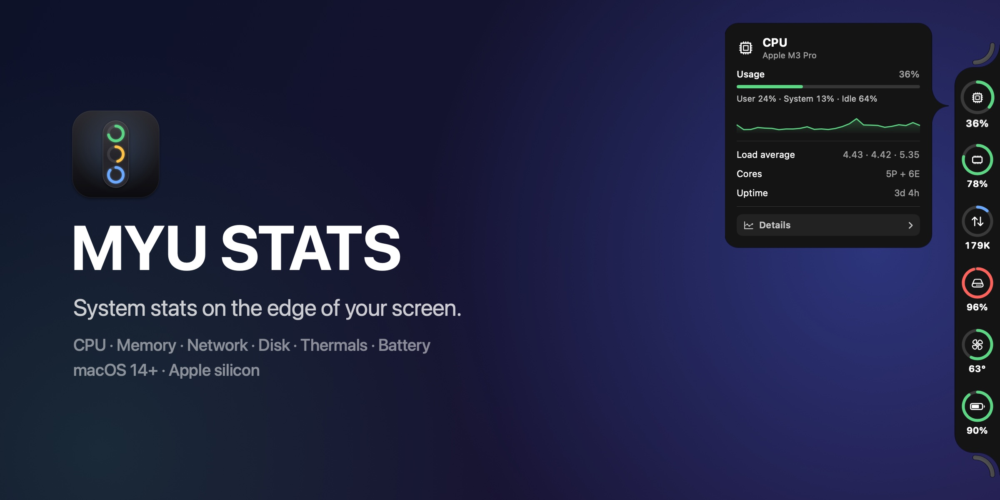
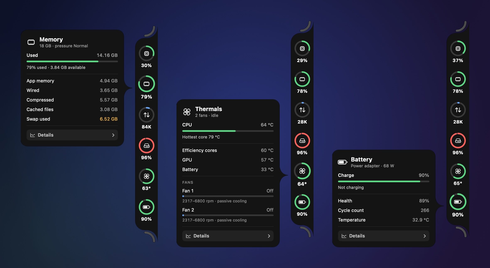
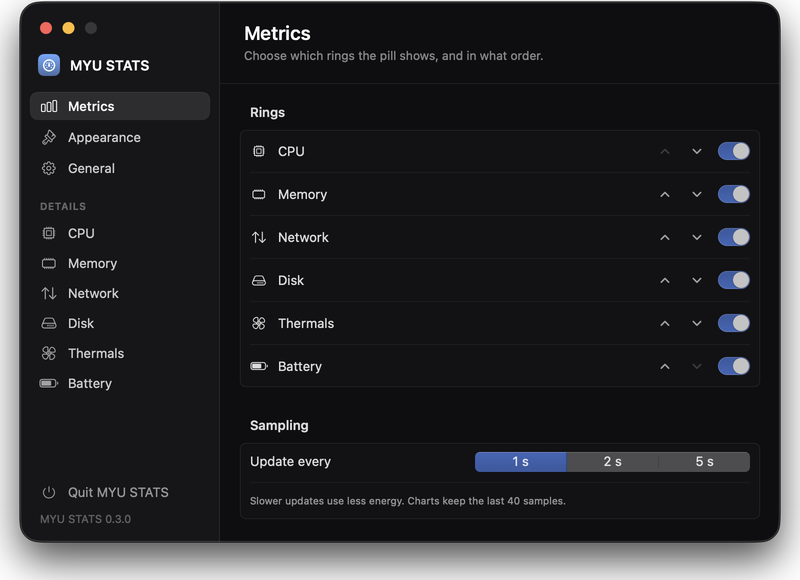
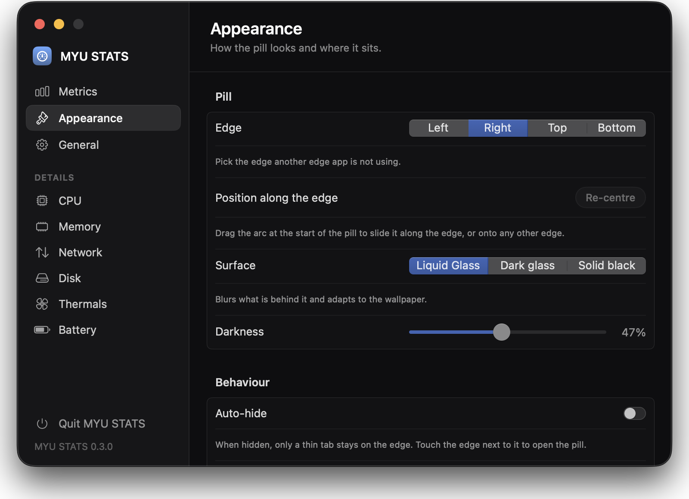
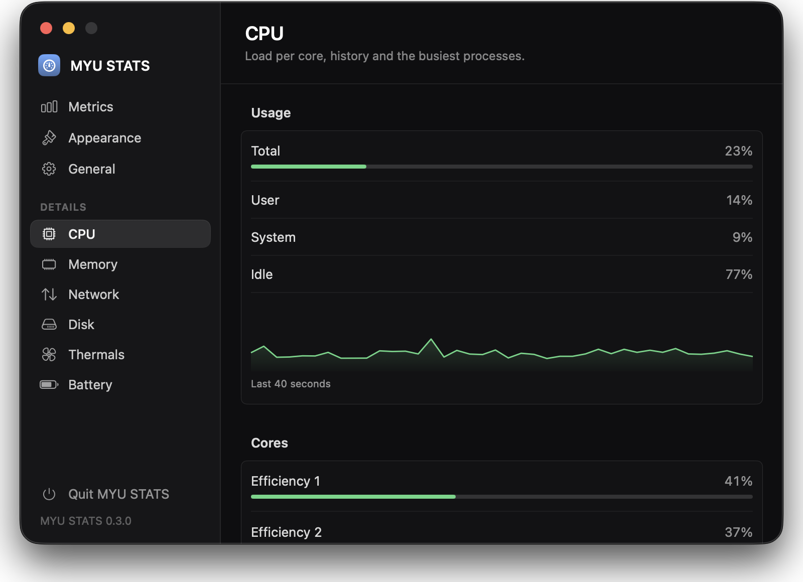
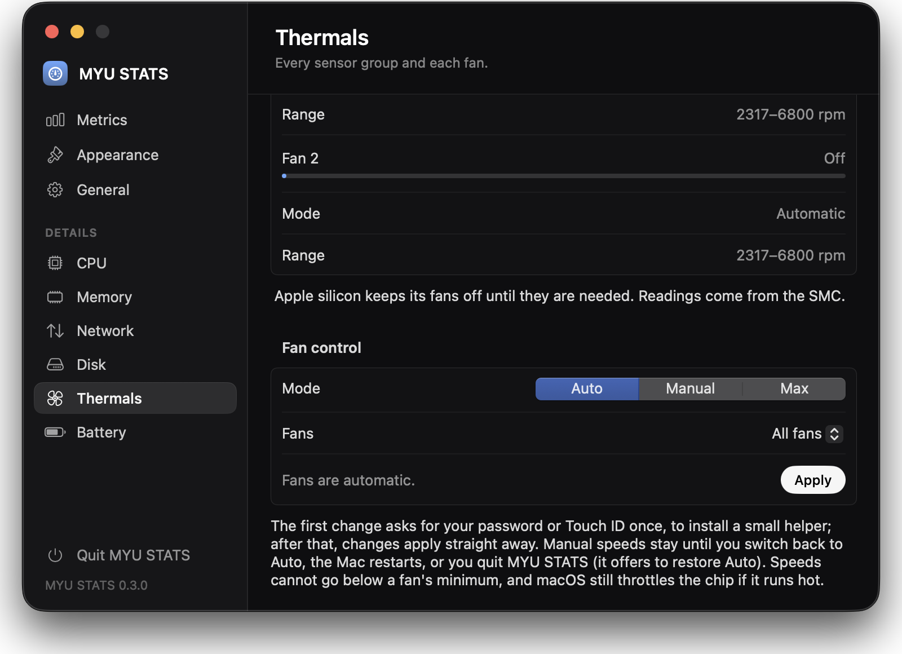
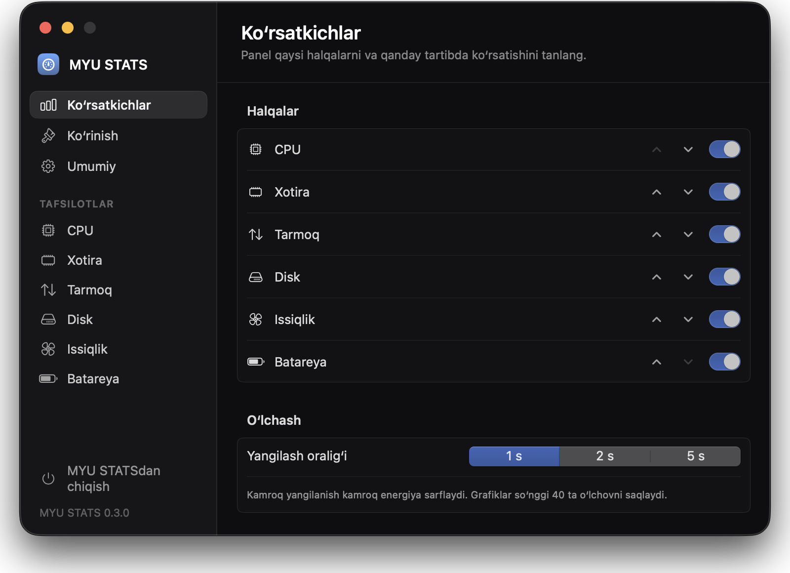

<div align="center">



[](https://github.com/Muhammadyunusxon/myu-stats/actions/workflows/test.yml)


**A macOS system monitor that lives on the edge of your screen: one ring per metric, a card with
the details when you point at one, and a full page in Settings when you want everything.**

</div>

CPU, memory, network, disk, thermals and battery sit in a glass pill welded to a screen edge. Point
at a ring and its card slides out: load and history, where the memory goes, throughput, free space,
temperatures and fans, battery health. Move away and the pill folds back into a thin tab, so it takes
no room until you reach for it.

## Download

[](https://github.com/Muhammadyunusxon/myu-stats/releases/latest/download/MYU-STATS.dmg)

That button is the disk image itself, not a page. The file is named `MYU-STATS.dmg` in every
release, so `releases/latest/download/` always resolves to the newest one and the link never needs
updating; the [release page](https://github.com/Muhammadyunusxon/myu-stats/releases/latest) has the
notes. Open it and drag **MYU STATS** onto **Applications**.

The build is ad-hoc signed and not notarized (there is no Developer ID certificate behind it), so
macOS quarantines the download. Clear the flag once, after dragging the app to Applications:

```sh
xattr -dr com.apple.quarantine "/Applications/MYU STATS.app"
```

If macOS says the app is *damaged*, that is the quarantine flag rather than a bad download: run the
command above.

Apple silicon, macOS 14 Sonoma or later. To build a copy from source instead, see
[Building](#building).

## What it shows



| Ring | Card | Details page |
|---|---|---|
| **CPU** | Usage split into user, system and idle, a 40-sample chart, load average, core layout, uptime, the busiest processes | Every core (efficiency cores first on Apple silicon), processor, threads, the top 10 processes |
| **Memory** | Used and available, app memory, wired, compressed, cached files, swap, memory pressure | The same breakdown with history, the top 10 processes by memory |
| **Network** | Download and upload rate, peak, totals since boot | History, the active interface and its address |
| **Disk** | Used and free space on the startup disk, a warning when it runs low | Every mounted volume, and what is using the space (below) |
| **Thermals** | CPU, efficiency-core, GPU and battery temperatures, every fan | Every sensor group, each fan's mode and range, fan control |
| **Battery** | Charge, time to full or empty, power source, health, cycle count, temperature | The same, as a page |

Each ring fills with its value and changes colour as it climbs: green, then amber, then red. Memory
follows macOS's own memory pressure rather than the percentage, and the battery stays green while it
is on power. Network fills relative to the recent peak, so an idle link does not look saturated.

**What's using space.** The Disk page measures everything in the home folder plus Applications,
largest first, and any folder opens to show what is inside it. Developer caches that are safe to
clear (Xcode DerivedData and simulators, Gradle, the Pub cache, CocoaPods, npm, Homebrew, Docker)
get their own list, each with the command that clears it. Measuring walks every file off the main
thread, so a large folder takes a moment; macOS may ask for access to Documents, Downloads or
Desktop, and declining just leaves those unmeasured.

## Placement

The pill lives on any of the four edges of any display. Left and right keep a vertical column; top
and bottom lay the rings out side by side, with the top one hanging under the menu bar rather than
over it.

Along that edge it sits wherever you put it. Drag the arc at the start of the pill to slide it, or
keep dragging towards another edge: slots light up on the other three, and letting go over one moves
the pill there. **Re-centre** in Settings › Appearance puts it back in the middle, and **Display**
picks the screen when there is more than one. A display that is unplugged hands the pill to the main
one until it comes back.

At rest it is a thin tab on the edge that unfolds when the pointer touches the edge beside it, and
folds again after a delay you choose. Switch **Auto-hide** off to keep it open. The surface is
Liquid Glass on macOS 26 (a blurred glass on earlier versions), a clearer dark glass, or solid black,
with a darkness slider for the glass ones.

## Settings

<table>
  <tr>
    <td></td>
    <td></td>
  </tr>
  <tr>
    <td></td>
    <td></td>
  </tr>
</table>

There is no Dock icon and no menu bar icon. Settings open from the gear in the arc at the end of the
pill, from a card's **Details** button, or by launching the app again from Finder or Spotlight;
while they are open the app shows up in ⌘-Tab. **Quit MYU STATS** sits at the foot of the sidebar.

| Pane | Options |
|---|---|
| Metrics | Show, hide and reorder the rings; update every 1, 2 or 5 seconds |
| Appearance | Edge, display, re-centre, surface, darkness, auto-hide and its delay |
| General | Open at login, top-process scanning, reset everything to defaults |
| Details | A full page per metric |

## Fan control

The Thermals page sets each fan, or all of them, to **Auto**, a **Manual** speed, or **Max**. Speeds
are clamped to what each fan supports, and macOS still throttles the chip if it runs hot.

Changing a fan needs root. The first change asks for your password or Touch ID once, to install a
small helper; after that, changes apply straight away. An app update installs its own helper once
more, because the installed one has to match the app exactly. **Remove** on the same page hands the
fans back to macOS and deletes the helper.

A manual speed stays until you switch back to Auto or the Mac restarts, so quitting while a fan is
held offers to restore Auto first; if that fails, the app stays open and says why rather than leaving
the fans pinned. How the helper is installed and checked is under [Fan helper](#fan-helper).

## Languages



English and Uzbek. MYU STATS follows the order of languages in System Settings › General ›
Language & Region, and can be set on its own under **Applications** on the same page.

Every string lives in one String Catalog, so another language is a translation away; see
[Localization](#localization).

<br clear="right">

## Building

Needs Xcode 26 or its command line tools (the macOS 26 SDK, for Liquid Glass). The app itself runs on
macOS 14 and later.

```sh
make run       # build "build/MYU STATS.app" and launch it
make install   # build, copy to /Applications and launch
make test      # swift test
make dmg       # build/MYU-STATS.dmg, as attached to a release
make icon      # regenerate Resources/AppIcon.icns from Scripts/make-icon.swift
make strings   # refresh Resources/Localizable.xcstrings from the source
make clean     # remove build artefacts
```

No signing identity is needed: `Scripts/bundle.sh` ad-hoc signs the fan helper, then the bundle. For
work in Xcode, `open Package.swift` and run the `MYUStats` scheme. CI builds with strict concurrency
checking and warnings as errors, runs the tests and assembles the bundle on every push to `main` and
every pull request.

The app has no window most of the time, so anything worth diagnosing goes to the unified log, under
the categories `app`, `sampling`, `fans`, `storage`, `settings` and `smc`:

```sh
/usr/bin/log stream --level info --predicate 'subsystem == "com.muhammadyunusxon.myustats"'
```

### Localization

Text is written in English in the code (`Text("…")`, `String(localized: "…")`) and translated in
`Resources/Localizable.xcstrings`. After adding or changing text, run `make strings`, then translate
the new entries in Xcode's catalog editor or the JSON. `bundle.sh` compiles the catalog into
`<language>.lproj` folders, and a test fails while any string lacks an Uzbek translation or a
translation drops a format specifier. To see another language without changing the system:

```sh
open "build/MYU STATS.app" --args -AppleLanguages '(uz)'
```

### Tests

78 Swift Testing cases in `Tests/MYUStatsTests`: the pill's geometry on all four edges, placement and
drop targets, formatting and settings, the store's sampling cadence and process demand (against a
fake source), network counter parsing, storage navigation on real temporary files, fan-command
parsing and rollback (against a fake SMC), the admin scripts, and the completeness of the string
catalog.

## Architecture

```
Sources/
├── MYUStats/            the app
│   ├── App/             entry point, AppDelegate (reopen, quit guard), settings keys, logging
│   ├── Metrics/         samplers, SamplingEngine, StatsStore, StorageAnalyzer, FanController
│   ├── Edge/            the pill: panel, controller, layout, cards, glass, drop zones, display choice
│   └── Settings/        window, sidebar, Panes/ (Metrics, Appearance, General), Details/ (one per metric)
├── SMCKit/              SMC client and FanControl, shared by the app and the helper
└── myustats-fan/        the privileged fan helper
Resources/               Info.plist, AppIcon.icns, Localizable.xcstrings
Tests/MYUStatsTests/
```

`StatsStore` ticks on a timer and asks a `StatsSource` for readings: in the app the `SamplingEngine`
actor, which runs every sampler off the main thread; in tests a fake. Only values that changed are
published, through Observation, so a view redraws only when something it reads moves. Disk, battery
and the network interface are read every fifth tick and thermals every second one, and processes are
scanned only while a card or page is showing them.

The pill works in edge-relative terms, *along* and *across* the edge, and `EdgeLayout` is the one
place that maps them onto a panel on a real screen, so all four edges share one set of rules and the
geometry is unit-tested without a screen. `EdgeController` follows mouse moves and hit-tests against
that layout. It polls only while something can change without the mouse moving, such as a card waiting
to close, so a folded pill costs no wakeups at all. The panel ignores the mouse except over its own
buttons, so it never takes a click meant for the window underneath.

### What it reads

| Metric | Source |
|---|---|
| CPU | `host_statistics(HOST_CPU_LOAD_INFO)`, per core `host_processor_info`, `getloadavg`, `hw.perflevel*` sysctls |
| Memory | `host_statistics64(HOST_VM_INFO64)`; swap `vm.swapusage`; pressure `kern.memorystatus_vm_pressure_level` |
| Processes | `proc_listallpids` and `proc_pid_rusage`, the current user's processes only |
| Network | `sysctl(NET_RT_IFLIST2)` 64-bit counters on `en*` and `pdp_ip*` (VPN tunnels left out, so traffic is not counted twice); address via `getifaddrs` |
| Disk | `volumeAvailableCapacityForImportantUsage`; other volumes via `mountedVolumeURLs`; folder sizes by walking files (`totalFileAllocatedSize`) |
| Battery | IOKit power sources, plus the `AppleSmartBattery` registry entry for health and cycles |
| Thermals and fans | The SMC, through `SMCKit`: sensor keys found by prefix (`Tp*`/`Te*` CPU, `Tg*` GPU, `TB*T` battery); fans `FNum`, `F<n>Ac/Mn/Mx/Md/Tg` |

### Fan helper

`myustats-fan` accepts only `auto|max <fan|all>` or `manual <fan|all> <rpm>`, refuses to run unless
its effective user is root, drops the caller's environment, and clamps every speed to the fan's own
range. It makes one change and exits, so no privileged process stays behind.

The copy inside the app bundle is writable by the user, so it is never run as root where it stands.
On the first change the app checks its own signature (the bundle on disk must be the app that is
running, with its seal intact) and reads the helper's code hash from it. The root shell copies the
helper into a fresh root-only folder, checks the copy against that hash with
`codesign --verify -R '=cdhash …'`, and installs it as
`/Library/PrivilegedHelperTools/com.muhammadyunusxon.myustats.fan`, owned by root and setuid. Later
changes run it without a prompt, but only while it is root-owned, writable by nobody else, validly
signed and carries the same hash as the helper in this app; anything else is refused and reinstalled.

On the SMC side, manual control raises `Ftst` (required on Apple silicon), sets `F<n>Md` to 1 and
writes `F<n>Tg`; Auto lowers the mode and `Ftst` so thermalmonitord takes the fans back. A change is
all or nothing: if one fan refuses, the fans that change took over are handed back and `Ftst` is
lowered again.

## The honest caveat

- Temperatures and fans come from the SMC, which Apple does not document. Every open-source monitor
  reads the same keys, but they can change between chips and macOS releases; when no sensor answers,
  the Thermals ring hides itself rather than showing a made-up number.
- The fan helper is the price of asking for the password once: any process running as you can use it
  to change fan speeds, within each fan's range, without a password. **Remove** takes it away.
- The download is ad-hoc signed and not notarized, hence the quarantine step above.
- Processes owned by root (WindowServer, kernel_task) are missing from the process lists, because
  reading them would need the app itself to run as root.
- Folder sizes count APFS clones and hard links once per path, so the totals are approximate.
- The pill does not fold away for full-screen apps, and dragging moves it between the edges of its
  own display; pick another display in Appearance.
- Errors reported by the root helper itself, such as "The SMC refused to change F0Md.", are in English
  only.
- Another edge app on the same edge will overlap it; give each its own edge.

Idle cost is about 0.5 to 3 % of one core, with no wakeups while the pill is folded and Settings are
closed. The rings are deliberately not animated from value to value: animating them kept SwiftUI
laying the panel out for most of every second.

**Upgrading from NotchStats:** the app used to be called NotchStats. On first launch MYU STATS copies
the old settings over once; open at login has to be switched on again.

Inspired by [Codenotch](https://github.com/vinzdg/codenotch)'s edge layout. A personal project, not
affiliated with Codenotch or Apple.
